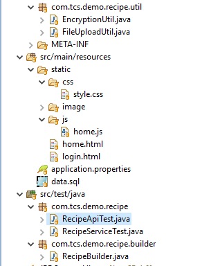

# Recipe Web Application using Spring Boot + REST + Spring Data JPA + Spring Security + JQuery Ajax + Bootstrap + Swagger2 + JUnit + Mockito
A single page web application which allows users to manage their favourite recipe with basic CRUD operations using an embedded database H2
# Requirements
<ul>
  <li>Java 8</li>
  <li>Apache Maven</li>
  <li>Bootstrap 3</li>
  <li>Spring Boot</li>
</ul>

# Quick Start
<ol>
<li>Import project in Eclipse / Spring Tool Suite</li>
<li>Find <code>RecipeApplication.java</code>, select 'Run As' > 'Java Application'.</li>
<li>Point browser to <a href="http://localhost:8080/kitchenworld/">http://localhost:8080/kitchenworld/</a>. If you want to change the context go to <code>application.properties</code> and change the value of <code>server.servlet.context-path</code></li>
<li>You should be redirected to a login page. By default a user with admin rights is created with credentials -> Username :  <code>admin</code> & Password : <code>password</code>
along with some dummy recipe data using the <code>data.sql</code> file</li>
<li>Project uses H2 as the embedded database and a <code>data base file</code> with name <code>recipe-db</code> is created in the user directory. To change the name of the file go to <code>application.properties</code> and change the value of <code>spring.datasource.url</code>. For more info visit <a href="http://www.h2database.com/html/faq.html">http://www.h2database.com/html/faq.html</a>.   
<b>Note:</b>  Data will not be permanently persisted unless you change the value of <code>spring.jpa.hibernate.ddl-auto</code>  to <code>update</code></li>
<li>By default, the H2 console is enabled and it hosted at <a href="http://localhost:8080/kitchenworld/h2-console/">http://localhost:8080/kitchenworld/h2-console/</a>. This can be changed in <code>application.properties</code> by changing the value of <code>spring.h2.console.enabled</code> and <code>spring.h2.console.path</code></li>
</ol>

# Project Structure

# API Endpoints
Access to API Documentation is over <a href="http://localhost:8080/kitchenworld/swagger-ui.html">http://localhost:8080/kitchenworld/swagger-ui.html</a> and <a href="http://localhost:8080/kitchenworld/v2/api-docs">http://localhost:8080/kitchenworld/v2/api-docs</a>

All endpoints are configured to accept Basic Authentication.<b>(For production grade code, Basic Authentication should not be used.)</b> You can change the configuration in <code>MultiHttpSecurityConfig.java</code>  For our dummy <code>admin</code> use <code>Authorization</code> header with value <code>Basic YWRtaW46cGFzc3dvcmQ=</code>.
## RECIPE
<ol>
<li><code>GET</code> single recipe : <a href="#">http://localhost:8080/kitchenworld/api/recipes/{id}</a></li>
<li><code>GET</code> all recipes : <a href="#">http://localhost:8080/kitchenworld/api/recipes/</a></li>
<li><code>GET</code> with limit and offset : <a href="#">http://localhost:8080/kitchenworld/api/recipes?limit={limit}&page={offset}</a></li>
<li><code>GET</code> total recipe size : <a href="#">http://localhost:8080/kitchenworld/api/recipes/size</a></li>
<li><code>POST</code> new recipe : <a href="#">http://localhost:8080/kitchenworld/api/recipes</a></li>
<li><code>PUT</code> update recipe : <a href="#">http://localhost:8080/kitchenworld/api/recipes/{id}</a></li>
<li><code>DELETE</code> recipe : <a href="#">http://localhost:8080/kitchenworld/api/recipes/{id}</a></li>
</ol>

# Tech Stack Choice

Spring Boot was chosen for this application as it has excellent support for embedded database h2 and spring security configuration along with easy and quick development support to create backend REST api and also configure spring data jpa and testing using JUnit and Mockito .The annotation support by spring boot helped to keep the development time within 3-4 days . JQuery supports asynchronous calls to backend api and json formats. Boostrap has support for modal and column grids which is used to display recipe details. Documentation of REST api is setup using swagger which provides a html page to view and execute calls. 
